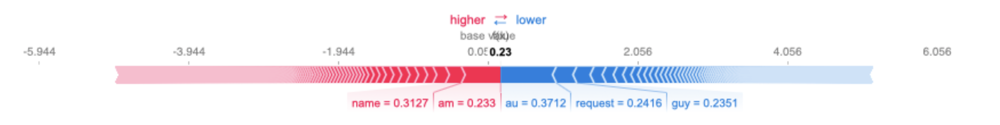
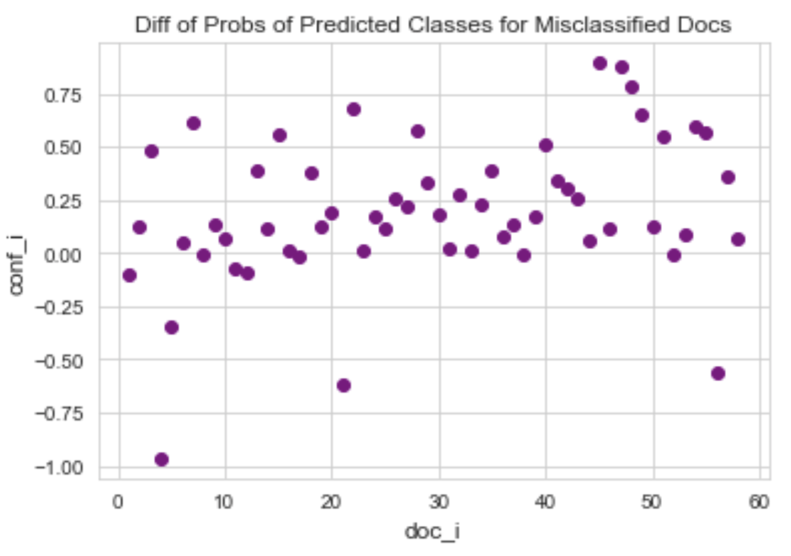
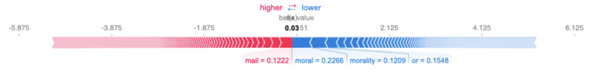

# Data Science SHAP Explanations: Project Overview

- Created a classifier to classify documents based on religious sentiment (accuracy ~ 91%)
- Preprocessed data using a TfidfVectorizer to transform text to feature vectors and filter out uncommon words
- Identified words that contributed to misclassification of documents and in which documents
- Generated visual explanations of feature values using SHAP
- Optimized classifier using chi-square filter feature selection to improve accuracy

## Code and Resources Used

**Python Version:** 3.8.8\
**Packages:** pandas, numpy, sklearn, seaborn, matplotlib, shap, tqdm, operator, collections, nltk, warnings\
**For Web Framework Requirements:** ```pip install !shap```

## Data Collection

The data was extracted from the 20 newsgroups dataset comprised of roughly 18000 newsgroups posts on 20 topics splits into two subsets for training and testing.

I focused on the religious documents (about 1100 texts) from two categories:
- Atheism
- Christianity

The data comprised of texts including, but not limited to:
- Emails
- Reviews
- Biblical excerpts

## Data Cleaning

After loading the data, it was already in good quality to be usable for the classifier.

However, I initialized and fit a tf-idf vectorizer to transform the text to feature vectors. 
Uncommon words were filtered out so that a word must occur in at least 10 different documents to be considered a feature.

I also performed chi-square filter feature selection to improve the classifier accuracy:
- Applied statistical score to each feature
- Ranked scores and decided to be kept or removed
- Proper method since handling categorical inputs and outputs (predictors and outcomes)

## EDA

I looked at the SHAP explanations and distributions of the text.
Below are a few visuals to highlight:

<p align="center">
  
  
  
</p>

## Classifier Building

First, I transformed and fit the vectorizer on the data. I also split the train and test data as subsets of the 20 newsgroups dataset.

I tried two different methods and evaluated them using Accuracy Score.
I chose accuracy score because it is easy to interpret and applies well for classifiers.
Accuracy score also assigns equal cost to false positive and false negative predictions.

I tried two different **SGDClassifiers** with L2 regularization:
- **Before Feature Selection** - Baseline for the classifier.
- **After Feature Selection** - Because of sparse data from the many categorical features, I thought feature selection using chi-square would be effective.

## Classifier Performance

The classifier after feature selection outperformed the other approach on the test set.
- Before Feature Selection : Accuracy = 91.91%
- After Feature Selection : Accuracy = 92.33%
